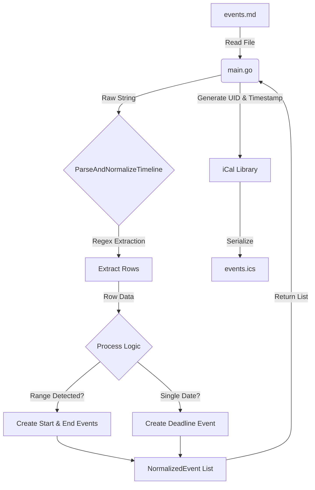

# mentoring-calendar
Public CNCF Mentoring Calendar

# LFX Mentorship Calendar Generator

This tool automates the creation of calendar events for LFX Mentorship programs. It parses a Markdown file containing a timeline table (specifically formatted like LFX program schedules), normalizes the dates, and generates an `.ics` (iCalendar) file compatible with Google Calendar, Outlook, and Apple Calendar & other calendars that implements [RFC 5545](https://www.rfc-editor.org/rfc/rfc5545.html)

## Features

- Markdown Parsing: Reads standard Markdown tables directly from an `events.md` file.
- Range Events: Splits multi-day ranges into specific **Opens** (Start Date) and **Closes** (End Date) events.
  - With Start day events timing set as `00:01 to 01:00`
  - With End day events timing set as `23:00 to 23:59` 
- Implicit Year Handling: Automatically detects the year from the end date if the start date is missing it (e.g., `Jan 20 – Feb 10, 2026`).
- Timezone Aware: Currently configured for **Asia/Kolkata** (adjustable in code).
- Standardized Output: Generates valid `.ics` files with unique IDs (UUIDs) for every event.

## Prerequisites
- [Go 1.25+](https://go.dev/dl/) installed on your machine.

## Installation & Setup

1. Clone the repository

    ```bash
    git clone https://github.com/bupd/mentoring-calendar.git
    cd mentoring-calendar
    ```

2. Install dependencies

    ```bash
    go mod tidy
    ```

## Usage

### 1\. Prepare your Data

Create a file named `events.md` in the root directory. Paste the timeline table from the LFX mentorship program page.

**Example `events.md` format:**

```markdown
### Timeline

| **Activity** | **Date** |
|--------------|----------|
| **Project Proposals Open** | Wednesday, January 7 – Tuesday, January 20, 2026 |
| **Mentee Applications Open** | Monday, January 26 – Tuesday, February 10, 2026 |
| **Selection Notifications** | Thursday, February 26, 2026 |
```

### 2\. Run the Generator

Execute the Go program:

```bash
go run main.go
```

### 3\. Usage & Import

There are two ways to add this timeline to your calendar. We strongly recommend **Subscribe Via URL** to ensure you receive automatic schedule updates.

#### Method 1: Subscribe via URL (Recommended)

This is the best method. By subscribing, your calendar will automatically sync if the program dates or schedule changes in the future.

1.  **Copy this URL:**
    ```text
    https://raw.githubusercontent.com/bupd/mentoring-calendar/refs/heads/main/events.ics
    ```
2.  **Add to Google Calendar:**
      * Open [Google Calendar](https://calendar.google.com).
      * Find "Other calendars" on the left sidebar.
      * Click the **+** button and select **From URL**.
      * Paste the link above and click **Add calendar**.
3.  **Add to Apple/Outlook:**
      * Look for the "New Calendar Subscription" or "Subscribe from Web" option in your app and paste the URL.

#### Method 2: One-time Import (Static)

If you prefer a static snapshot that **will not update**, you can upload the file manually.

1.  Run the program locally to generate the `events.ics` file.
2.  Open your calendar settings and look for **Import**.
3.  Upload the `events.ics` file from your computer.

-----

## ⚙️ Configuration

Currently, configuration is done by modifying `main.go` directly.

  * **Change Timezone:**
    Locate line 30 in `main.go` to change the region (defaults to `Asia/Kolkata`):

    ```go
    loc, err := time.LoadLocation("America/Los_Angeles") // Change here
    ```

  * **Change Input File:**
    Locate line 18 in `main.go`:

    ```go
    data, err := os.ReadFile("my_schedule.md") // Change filename here
    ```


## 🤝 Contributing

We welcome contributions\! Whether it's adding command-line flags, supporting more date formats, or improving error handling.

### TODO: 
- [ ] Add dynamic input file selection
- [ ] Add dynamic output filename
- [ ] Add timezone selection
- [ ] Add github action
- [ ] Add multi file input
- [ ] Add option to extend the already present .ics file with new events

### Project Architecture

The project is split into the Main entry point and the Timeline logic package.



### Development Workflow

1.  **Fork** the repository.
2.  **Create a branch** for your feature:
    ```bash
    git checkout -b feature/add-cli-flags
    ```
3.  **Modify the logic** in `timeline/timeline.go` or the orchestration in `main.go`.
4.  **Test your changes** by running `go run main.go` and inspecting the generated `.ics` file content.
5.  **Commit and Push**:
    ```bash
    git commit -m "Add support for CLI flags"
    git push origin feature/add-cli-flags
    ```
6.  Open a **Pull Request**.

### Key files

  * `main.go`: Handles file I/O, timezone loading, and iCal generation.
  * `timeline/timeline.go`: Contains the regex logic for parsing Markdown tables and the business logic for date normalization (Opens/Closes).

-----

## 📄 License
[Apache License 2.0](LICENSE)
